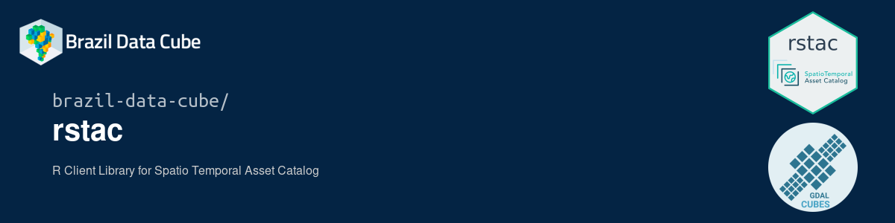

## RSTAC
#### Script R
  ```
Pesquisa e recupera conjuntos de dados de observação da Terra usando a interface padronizada
 SpatioTemporal Asset Catalog (STAC).

Cria uma série temporal (spatio-temporal array) a partir dos assets retornarnados pela API STAC.

Exporta a série temporal para o formato NetCDF ou GeoTIFF.

> str(time_serie)
Classes 'fill_time_cube', 'cube', 'xptr' <externalptr> 

A data cube proxy object - Reduce time: 1 Month

Dimensions:
               low             high count pixel_size chunk_size
t       2021-10-01       2022-04-30     7        P1M          1
y 7699753.68441534 7704253.68441534    45        100         45
x 415665.031861902 421965.031861902    63        100         63

Bands:
  name offset scale nodata unit
1  B02      0     1    NaN     
2  B03      0     1    NaN     
3  B04      0     1    NaN     
4  B08      0     1    NaN     
5  B8A      0     1    NaN     
6  SCL      0     1    NaN  

```

<p align="center" width="60%">
     
</p>


### Referências:

R. Simoes, F. C. de Souza, M. Zaglia, G. R. de Queiroz, R. D. C. dos Santos and K. R. Ferreira, “Rstac: An R Package to Access Spatiotemporal Asset Catalog Satellite Imagery,” 2021 IEEE International Geoscience and Remote Sensing Symposium IGARSS, 2021, pp. 7674-7677, doi: 10.1109/IGARSS47720.2021.9553518. <https://github.com/brazil-data-cube/rstac>

E. Appel, M.; Pebesma. On-demand processing of data cubes from satellite image collections with the gdalcubes library. Data, 2019. doi:https://doi.org/10.3390/data4030092.

https://gdalcubes.github.io/

https://stacspec.org/en/

https://planetarycomputer.microsoft.com/

https://element84.com/earth-search/

