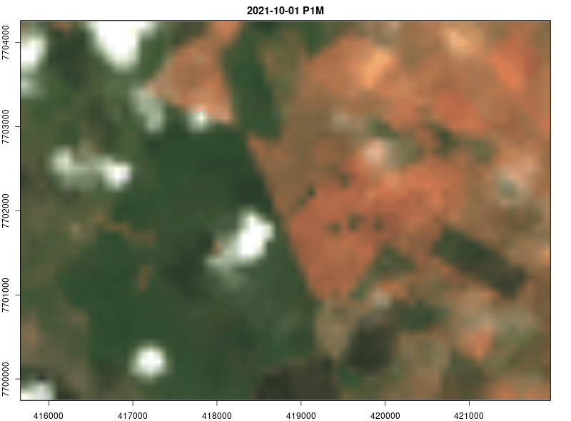

## STAC

<p align="justify">
Pesquisa e recupera conjuntos de dados de observação da Terra usando a interface padronizada SpatioTemporal Asset Catalog (STAC).

Cria uma série temporal (spatio-temporal array) a partir dos assets retornarnados pela API STAC.

Exporta a série temporal para o formato NetCDF ou GeoTIFF.

```
  ____ _____  __   _____
 / ___|_   _|/ \  / ___|
 \___ \ | | / _ \| |
  ___) || |/ ___ \ |___
 |____/ |_/_/   \_\____|

            _       _            _
           | |     | |          | |
   __ _  __| | __ _| | ___ _   _| |__   ___  ___
  / _` |/ _` |/ _` | |/ __| | | | '_ \ / _ \/ __|
 | (_| | (_| | (_| | | (__| |_| | |_) |  __/\__ \
  \__, |\__,_|\__,_|_|\___|\__,_|_.__/ \___||___/
   __/ |
  |___/
```


<p align="center" width="100%">
     
</p>


### Referências:

R. Simoes, F. C. de Souza, M. Zaglia, G. R. de Queiroz, R. D. C. dos Santos and K. R. Ferreira, “Rstac: An R Package to Access Spatiotemporal Asset Catalog Satellite Imagery,” 2021 IEEE International Geoscience and Remote Sensing Symposium IGARSS, 2021, pp. 7674-7677, doi: 10.1109/IGARSS47720.2021.9553518. <https://github.com/brazil-data-cube/rstac>

E. Appel, M.; Pebesma. On-demand processing of data cubes from satellite image collections with the gdalcubes library. Data, 2019. doi:https://doi.org/10.3390/data4030092.

https://gdalcubes.github.io/

https://stacspec.org/en/

https://planetarycomputer.microsoft.com/

https://element84.com/earth-search/

